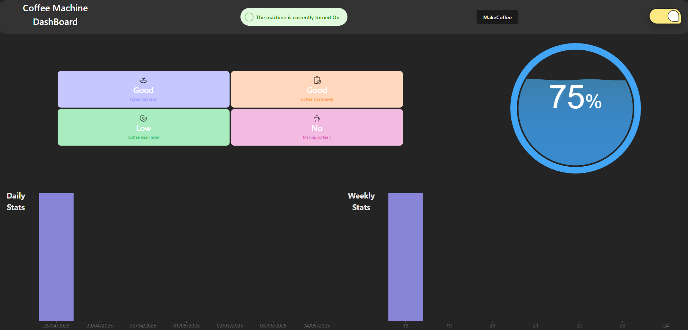
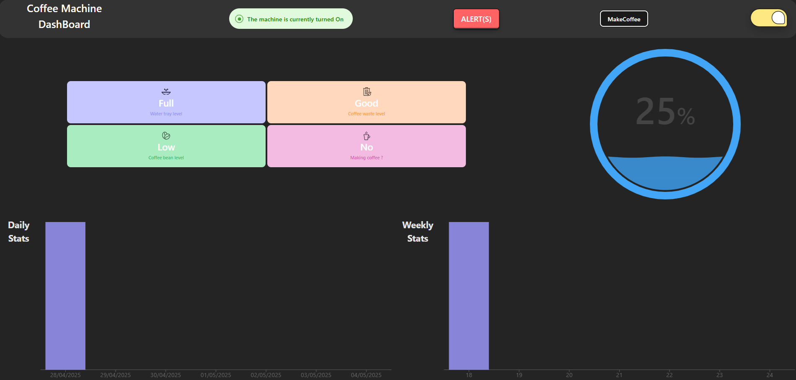
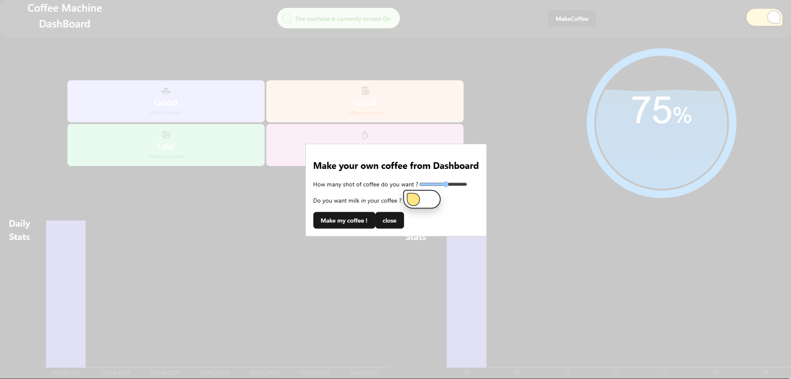

# SmartCoffeeMachine – Frontend

This is the frontend interface for controlling a connected coffee machine. Built using React, TypeScript, and Vite, it communicates with a REST API backend.

## 🔎 Preview

### Video presentation

[Presentation Video](./src/assets/2025-04-29%2012-03-14.mp4)

### No alert mode



### Alert mode



### Make coffee



## 🧱 Tech Stack

- **React** with **TypeScript**
- **Vite** for fast build and development
- **Axios** for HTTP requests
- **ESLint** with TypeScript and React support

## 🚀 Getting Started

### Prerequisites

- Node.js (v18+ recommended)
- npm or yarn

### Installation

```bash
git clone https://github.com/Jahiel/SmartCoffeeMachineFront
cd SmartCoffeeMachineFront
npm install
```

### Start in Development Mode

```bash
npm run dev
```

The app will be available at `http://localhost:5173` by default.

### API Configuration

This frontend communicates with the SmartCoffeeMachine (available at [SmartCoffeeMachine](https://github.com/Jahiel/SmartCoffeeMachine)) API. You can configure the API URL using a `.env` file:

```env
VITE_API_URL=WIP
```

## 📦 Production Build

```bash
npm run build
```

The compiled assets will be available in the `dist/` folder.

## ✅ Linting

This project includes a basic ESLint setup that can be extended for production use:

```js
// eslint.config.js
export default tseslint.config({
  extends: [
    ...tseslint.configs.recommendedTypeChecked,
    // or for stricter rules:
    // ...tseslint.configs.strictTypeChecked,
    // and for style rules:
    // ...tseslint.configs.stylisticTypeChecked,
  ],
  languageOptions: {
    parserOptions: {
      project: ["./tsconfig.node.json", "./tsconfig.app.json"],
      tsconfigRootDir: import.meta.dirname,
    },
  },
});
```

To further enhance linting, you can use:

- [`eslint-plugin-react-x`](https://github.com/Rel1cx/eslint-react/tree/main/packages/plugins/eslint-plugin-react-x)
- [`eslint-plugin-react-dom`](https://github.com/Rel1cx/eslint-react/tree/main/packages/plugins/eslint-plugin-react-dom)

```js
import reactX from "eslint-plugin-react-x";
import reactDom from "eslint-plugin-react-dom";

export default tseslint.config({
  plugins: {
    "react-x": reactX,
    "react-dom": reactDom,
  },
  rules: {
    ...reactX.configs["recommended-typescript"].rules,
    ...reactDom.configs.recommended.rules,
  },
});
```

## 📁 Project Structure

```
src/
├── assets/          # Static files (images, fonts, etc.)
├── components/      # Reusable UI components
├── pages/           # Application views
  ├── Modals/           # Modals views
├── types/           # Types for JS -> TS module
├── App.tsx          # App root component
├── main.tsx         # Entry point
```

## 🧩 License

MIT – see [LICENSE](LICENCE.TXT) for details.
